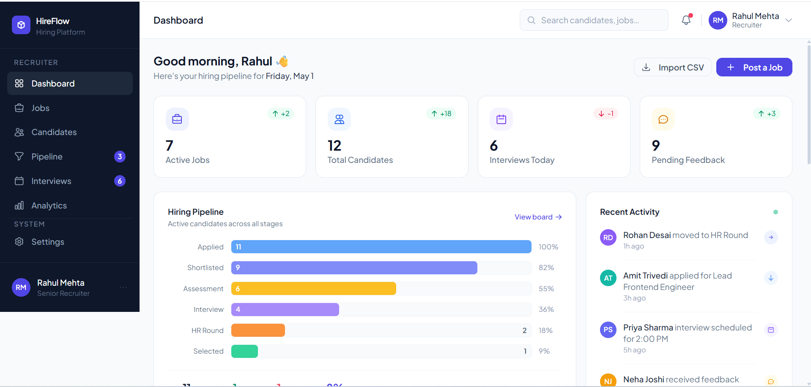
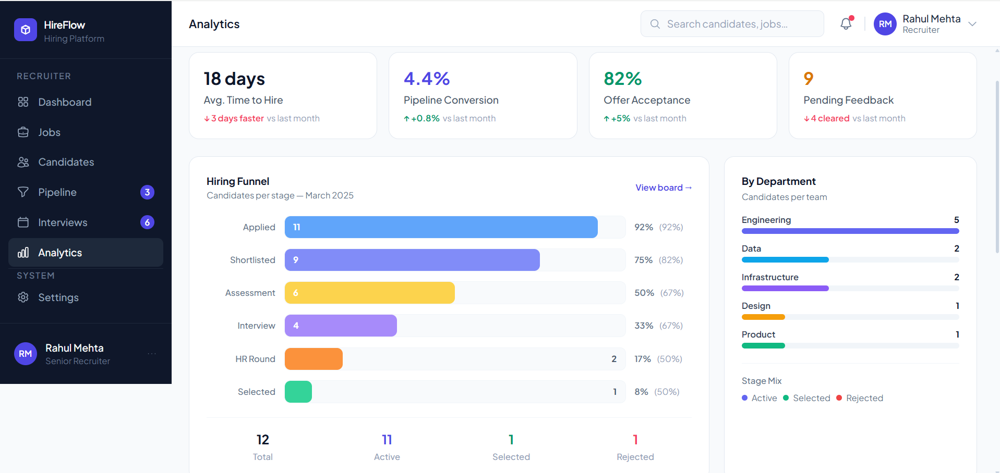
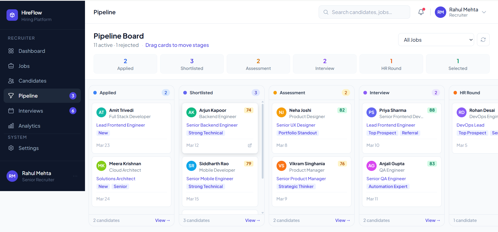
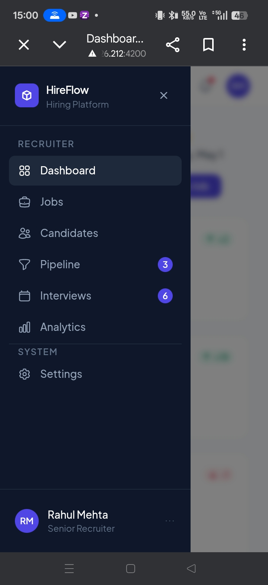
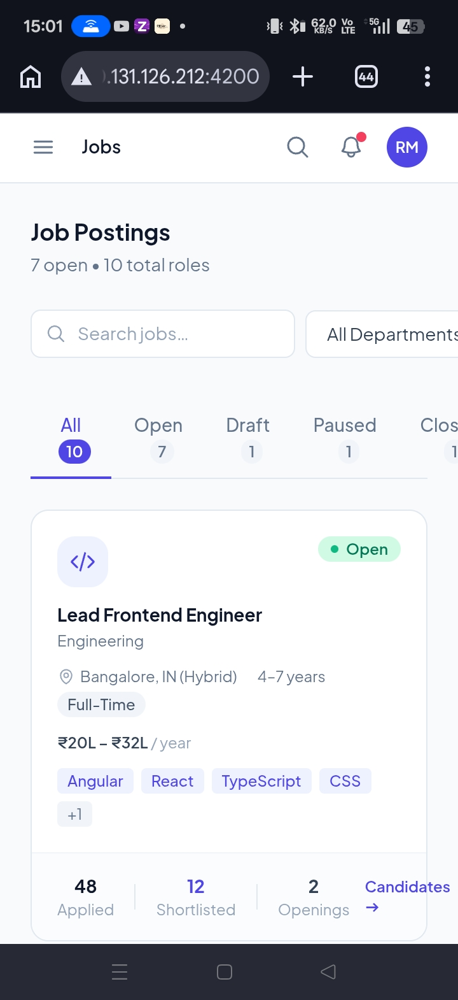
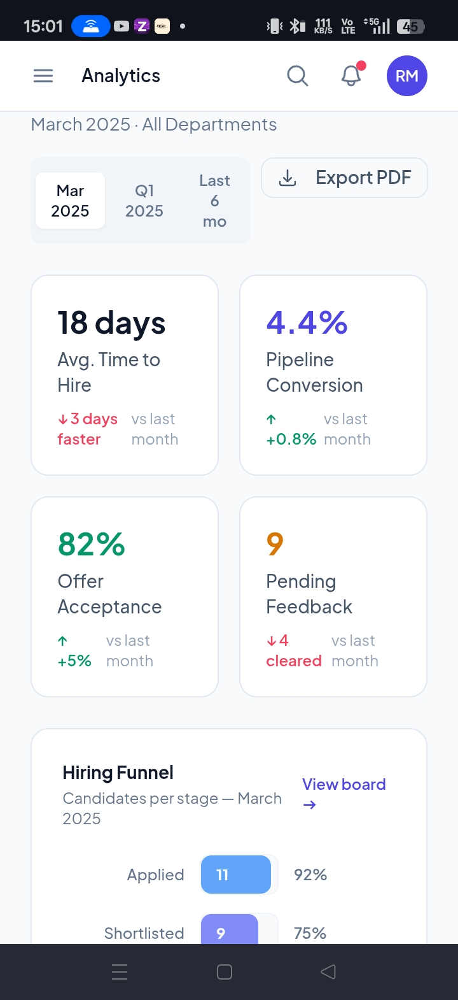

# 🚀 HireFlow — Hiring Pipeline Management Platform

> A modern, full-featured recruitment management platform built with **Angular 20** — designed to streamline the end-to-end hiring lifecycle for teams and candidates alike.


---

## 📋 Table of Contents

- [Overview](#overview)
- [Features](#features)
- [Tech Stack](#tech-stack)
- [Getting Started](#getting-started)
- [Demo Access](#demo-access)
- [Architecture](#architecture)
- [Pipeline Stages](#pipeline-stages)
- [Backend Integration](#backend-integration)
- [Preview Images](#preview-images)
- [Contributing](#contributing)

---

## 🔍 Overview

HireFlow enables recruiting teams to manage every stage of the hiring process in one place — from the moment a candidate applies to the final hiring decision.

The platform provides dedicated interfaces for **Recruiters** and **Candidates**, ensuring structured workflows, transparent communication, and data-driven hiring decisions.

---

## ✨ Features

- 🔐 **Role-based Access Control** — Separate views and permissions for Recruiters & Candidates
- 📊 **Visual Kanban Pipeline** — Drag-and-drop style hiring board across all stages
- 👤 **Candidate Profiles** — Detailed candidate management with history and notes
- 📅 **Interview Scheduling** — Schedule, manage, and collect feedback on interviews
- 📈 **Analytics Dashboard** — Hiring insights, pipeline metrics, and conversion stats
- 📱 **Fully Responsive UI** — Optimized for mobile, tablet, and desktop
- ⚡ **Performance Optimized** — Lazy-loaded routes for fast load times

---

## 🛠️ Tech Stack

| Layer | Technology |
|---|---|
| Framework | Angular 20 (Standalone Components) |
| Styling | Tailwind CSS + daisyUI |
| State Management | Angular Signals |
| Forms | Reactive Forms |
| Routing | Lazy-loaded Angular Router |
| Language | TypeScript |

---

## 🚀 Getting Started

### Prerequisites

- Node.js `v18+`
- npm `v9+`

### Installation

```bash
# 1. Clone the repository
git clone https://github.com/gitamrit1443/hireflow.git

# 2. Navigate to the project directory
cd hireflow

# 3. Install dependencies
npm install

# 4. Start the development server
ng s --host 0.0.0.0 --port 4200 
```

The application will be available at **http://localhost:4200**


---

## 🔑 Demo Access

Use the following credentials to explore the platform:

| Role | Email | Password |
|---|---|---|
| 👔 Recruiter | recruiter@hireflow.com | demo1234 |
| 🙋 Candidate | candidate@hireflow.com | demo1234 |

---

## 🏗️ Architecture

HireFlow follows a **modular, feature-based architecture** designed for scalability and maintainability.

```
src/
├── app/
│   ├── core/               # Guards, interceptors, base services
│   ├── features/
│   │   ├── auth/           # Login, role routing
│   │   ├── dashboard/      # Analytics & overview
│   │   ├── pipeline/       # Kanban hiring board
│   │   ├── candidates/     # Candidate profiles & management
│   │   └── interviews/     # Scheduling & feedback
│   └── shared/             # Reusable UI components & utilities
```

### Key Architectural Decisions

- **Standalone Components** — No NgModule overhead, cleaner and more tree-shakeable
- **Angular Signals** — Fine-grained reactivity without RxJS complexity for local state
- **Lazy Loading** — Each feature module loads on demand for faster initial bundle
- **Service-driven Data Layer** — Mock-ready services that are fully API-extensible

---

## 🔄 Pipeline Stages

Candidates progress through the following stages:

```
Apply → Shortlist → Test → Interview → Offer / Reject
```

Each stage supports status tracking, notes, feedback, and timestamps for complete auditability.

---

## 🔌 Backend Integration

The app currently runs on a **mock data service**. Switching to a real backend is straightforward:

1. Replace mock services in `src/app/core/services/` with HTTP-based services
2. Use Angular's built-in `HttpClient`
3. Return `Observable<T>` for all async data operations

```typescript
// Example: Replace mock with real API call
getCandidates(): Observable<Candidate[]> {
  return this.http.get<Candidate[]>('/api/candidates');
}
```

---
## Preview Images

# On Laptop




# On Mobile





## 🤝 Contributing

Contributions are welcome! To get started:

1. Fork the repository
2. Create a feature branch: `git checkout -b feature/your-feature-name`
3. Commit your changes: `git commit -m 'feat: add your feature'`
4. Push to the branch: `git push origin feature/your-feature-name`
5. Open a Pull Request

Please follow [Conventional Commits](https://www.conventionalcommits.org/) for commit messages.

---

## 📄 License

This project is licensed under the **MIT License** — see the [LICENSE](LICENSE) file for details.

---

<p align="center">Built By Amritpal Singh(BackToEra) using Angular 20</p>
